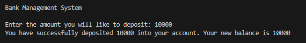
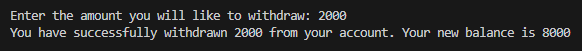
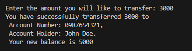

# Bank Management System - OOP Python Project

I designed and implemented a simple Bank Management System using Object-Oriented Programming (OOP) principles in Python.

## How to run your program
- Clone this repo and cd into this folder
- Run `python main.py` on your terminal
- You will be prompted to enter the amount you will like to deposit, withdraw and transfer

### Deposit Money
- Enter the amount you will like to deposit  

### Withdraw Money
- Enter the amount you will like to withdraw  

### Check Balance
- Your current balance will be shown  

### Transfer Money
- Enter the amount you will like to transfer  

 

Thank you